# Multi-Process & Multi-Thread Communication Experiment

This project implements and compares four different communication patterns in C:

1. Single Process Single Thread
2. Single Process Multi Thread
3. Multi Process Single Thread
4. Multi Process Multi Thread

## Historical Context and Architectural Evolution

### 1. Single Process Single Thread
The single process single thread model represents the earliest form of server architecture, dating back to the early days of network programming. This model was widely used in early web servers like the original NCSA HTTPd (1993) and its successor Apache 1.x. The simplicity of this model made it easy to implement and debug, but its sequential nature limited scalability.

**Key Technologies:**
- Apache 1.x (1995-2002)
- Traditional CGI-based web applications
- Early FTP and SMTP servers

**Limitations:**
- C10K problem: Unable to handle more than 10,000 concurrent connections
- Blocking I/O operations cause performance bottlenecks
- Poor resource utilization on modern multi-core systems

### 2. Single Process Multi Thread
The multi-threaded model emerged as a solution to the scalability limitations of single-threaded servers. This approach gained popularity in the late 1990s with the rise of Java-based application servers like Tomcat and JBoss. The model was particularly effective for applications with high I/O wait times, as threads could handle multiple connections concurrently.

**Key Technologies:**
- Apache Tomcat (1999-present)
- Java EE application servers
- Traditional RDBMS like MySQL and PostgreSQL

**Challenges:**
- Thread synchronization overhead
- Memory consumption per thread
- Complex debugging due to shared state
- Limited by OS thread limits

### 3. Multi Process Single Thread
The multi-process model became popular with the introduction of the prefork MPM in Apache 2.0 (2002). This model provided better isolation and stability compared to multi-threaded approaches. Each process handled its own connections independently, making it more resilient to crashes.

**Key Technologies:**
- Apache 2.x with prefork MPM
- PHP-FPM (FastCGI Process Manager)
- Python WSGI servers like Gunicorn

**Advantages:**
- Process isolation improves stability
- Better memory management
- Easier debugging and monitoring
- Natural load balancing across CPU cores

### 4. Multi Process Multi Thread
The hybrid model combining processes and threads emerged to address the limitations of pure process or thread-based approaches. This architecture became popular with modern application servers and database systems that needed to balance performance, scalability, and resource utilization.

**Key Technologies:**
- Nginx (2004-present)
- PostgreSQL (multi-process with worker threads)
- Modern Java application servers
- Cloud-native microservices

**Evolution:**
- Event-driven architectures (Node.js, 2009)
- Coroutine-based frameworks (Go, 2009)
- Actor model implementations (Akka, 2009)
- Service mesh architectures (Istio, 2017)

## Modern Solutions and Alternatives

### Event-Driven Architecture
The limitations of traditional threading models led to the development of event-driven architectures. Node.js (2009) popularized this approach by using a single-threaded event loop with non-blocking I/O operations.

**Key Technologies:**
- Node.js (V8 engine)
- Python asyncio (2014)
- Rust tokio runtime
- Go goroutines

**Advantages:**
- Efficient handling of I/O-bound workloads
- Lower memory footprint
- Better scalability for concurrent connections
- Simplified programming model

### Cloud-Native Architectures
Modern cloud-native applications often combine multiple architectural patterns:

1. **Service Mesh:**
   - Istio, Linkerd
   - Sidecar pattern for service-to-service communication
   - Automatic load balancing and circuit breaking

2. **Serverless:**
   - AWS Lambda, Google Cloud Functions
   - Event-driven, stateless execution
   - Automatic scaling and resource management

3. **Container Orchestration:**
   - Kubernetes, Docker Swarm
   - Process isolation through containers
   - Resource management and scheduling

## Project Structure

```
.
├── README.md
├── src/
│   ├── single_process_single_thread/
│   ├── single_process_multi_thread/
│   ├── multi_process_single_thread/
│   └── multi_process_multi_thread/
├── include/
│   └── common.h
└── Makefile
```

## Understanding Process and Thread Behavior

### 1. Process Management Commands

```bash
# List all processes
ps aux | grep server

# Example output:
# subaru 67068 0.0 0.0 33736044 1736 server  # Main server process
# subaru 67071 0.0 0.0 33730764 1664 client  # Client process

# List processes with thread information
ps -eLf | grep server

# Check network connections
netstat -an | grep 8081
lsof -i :8081
```

### 2. Process and Thread Creation

#### Single Process Single Thread
The single process single thread implementation operates by having one main process that handles all connections sequentially. This process can be monitored using the `ps aux` command, which displays its unique process ID. Network connections are processed one at a time, ensuring that each client receives undivided attention from the server. The following log demonstrates this behavior:

```
[INFO] Server started on port 8081
[INFO] New connection from 127.0.0.1:54931
[PACKET] RECV: hello its first
[PACKET] SEND: hello its first
```

#### Single Process Multi Thread
In the single process multi thread implementation, the main process creates new threads for each incoming connection. This thread creation can be observed in the `ps -eLf` output, which shows the relationship between the main process and its child threads. The system uses `pthread_create()` to spawn new threads and `pthread_detach()` to automatically clean up thread resources when they complete their tasks. This approach allows multiple connections to be handled concurrently within the same process space.

#### Multi Process Single Thread
The multi process single thread implementation works by having the main process fork new child processes for each incoming connection. These child processes are visible in the `ps aux` output as separate entries with their own process IDs. The system uses the `fork()` system call to create these child processes, which then handle individual connections independently. This approach provides process isolation but requires more system resources.

#### Multi Process Multi Thread
The multi process multi thread implementation represents the most complex and scalable approach. It combines both `fork()` and `pthread_create()` to create multiple processes, each of which can spawn multiple threads. Worker processes share the listening socket, allowing for efficient distribution of incoming connections. This architecture provides the highest level of concurrency but also requires careful resource management.

### 3. Context Switching and Implementation

#### Types of Context Switches
1. **Process Context Switch**
   - Involves saving and restoring the entire process state
   - Includes memory space, file descriptors, and register values
   - More expensive than thread context switches
   - Example Linux implementation:
   ```c
   // arch/x86/kernel/process_64.c
   __visible __notrace_funcgraph struct task_struct *
   __switch_to(struct task_struct *prev_p, struct task_struct *next_p)
   {
       struct thread_struct *prev = &prev_p->thread;
       struct thread_struct *next = &next_p->thread;
       
       // Save floating point state
       save_fpu(prev);
       
       // Switch stack
       switch_to_extra(prev_p, next_p);
       
       // Switch TLS
       switch_to_thread_local_storage(next_p);
       
       // Load new state
       load_fpu(next);
       
       return prev_p;
   }
   ```

2. **Thread Context Switch**
   - Only saves and restores thread-specific state
   - Shares memory space with other threads
   - More efficient than process context switches
   - Example Linux implementation:
   ```c
   // kernel/sched/core.c
   static __always_inline struct rq *
   context_switch(struct rq *rq, struct task_struct *prev,
                 struct task_struct *next, struct rq_flags *rf)
   {
       struct mm_struct *mm, *oldmm;
       
       // Prepare the next task
       prepare_task_switch(rq, prev, next);
       
       // Switch memory space
       mm = next->mm;
       oldmm = prev->active_mm;
       
       // Switch to new task
       switch_mm_irqs_off(oldmm, mm, next);
       
       // Switch registers and stack
       switch_to(prev, next, prev);
       
       return finish_task_switch(prev);
   }
   ```

#### Multi-Threading Challenges
1. **Resource Management**
   - Threads share memory space, requiring careful synchronization
   - Improper resource cleanup can lead to memory leaks
   - Example log showing resource cleanup:
   ```
   [INFO] Thread cleanup started
   [DEBUG] Releasing mutex locks
   [DEBUG] Closing file descriptors
   [INFO] Thread resources cleaned up
   ```

2. **Synchronization Overhead**
   - Mutex locks and condition variables add latency
   - Deadlocks can occur if synchronization is not properly managed
   - Example synchronization code:
   ```c
   pthread_mutex_t lock = PTHREAD_MUTEX_INITIALIZER;
   pthread_cond_t cond = PTHREAD_COND_INITIALIZER;
   
   void* thread_function(void* arg) {
       pthread_mutex_lock(&lock);
       // Critical section
       pthread_cond_signal(&cond);
       pthread_mutex_unlock(&lock);
       return NULL;
   }
   ```

### 4. Debugging and Monitoring

#### Process Monitoring
```bash
# Check process hierarchy
pstree -p | grep server

# Monitor process resource usage
top -p $(pgrep -d',' -f server)
```

#### Network Monitoring
```bash
# Monitor packet flow
tcpdump -i lo0 port 8081 -X

# Check socket states
ss -tulpn | grep 8081
```

#### Packet Logging
The implementation includes detailed packet logging:
```
[PACKET] SEND: 68 65 6c 6c 6f 20 69 74 73 20 66 69 72 73 74 
[PACKET] SEND (ASCII): hello its first
```

### 5. Resource Management

#### Process Cleanup
```bash
# Kill specific process
kill -9 <PID>

# Kill all server processes
pkill -f server

# Kill processes using specific port
sudo lsof -i :8081 -t | xargs kill -9
```

#### Memory Management
Each process maintains its own memory space, while threads within a process share the same memory space. This shared memory model requires careful resource cleanup in multi-process and multi-thread scenarios to prevent memory leaks and ensure proper resource deallocation.

## Performance Considerations

1. **Single Process Single Thread**
   The single process single thread implementation provides the simplest architecture but has limited scalability. While it has no concurrency overhead, it is best suited for applications with a small number of connections due to its sequential processing nature.

2. **Single Process Multi Thread**
   The single process multi thread implementation is particularly effective for I/O-bound tasks. Threads share memory space, which reduces overhead compared to multi-process solutions. However, this approach requires careful thread synchronization to prevent race conditions and ensure data consistency.

3. **Multi Process Single Thread**
   The multi process single thread implementation is well-suited for CPU-bound tasks. Each process operates in its own isolated memory space, providing better protection against crashes. However, this isolation comes at the cost of higher memory usage and process creation overhead.

4. **Multi Process Multi Thread**
   The multi process multi thread implementation offers the most flexible and scalable approach. While it provides the highest level of concurrency, it also introduces the most complexity and requires the most system resources. This architecture is best suited for high-performance applications that can benefit from both process and thread-level parallelism.

## Troubleshooting

See the Troubleshooting section for common issues and their solutions.

## Architecture Diagrams

### 1. Single Process Single Thread
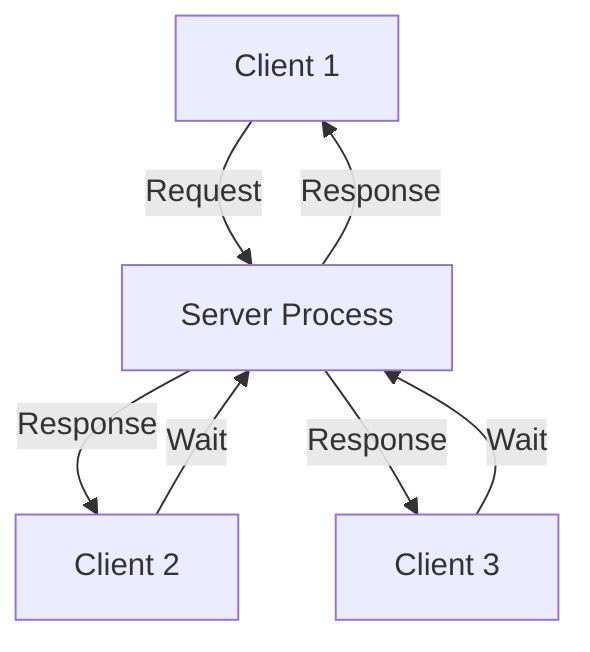

### 2. Single Process Multi Thread
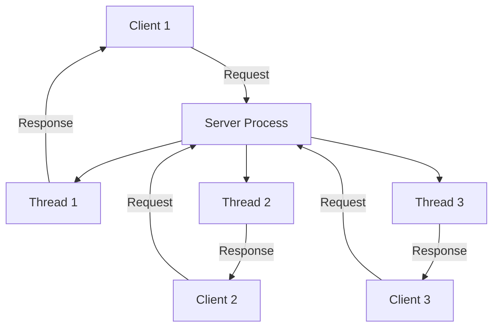

### 3. Multi Process Single Thread
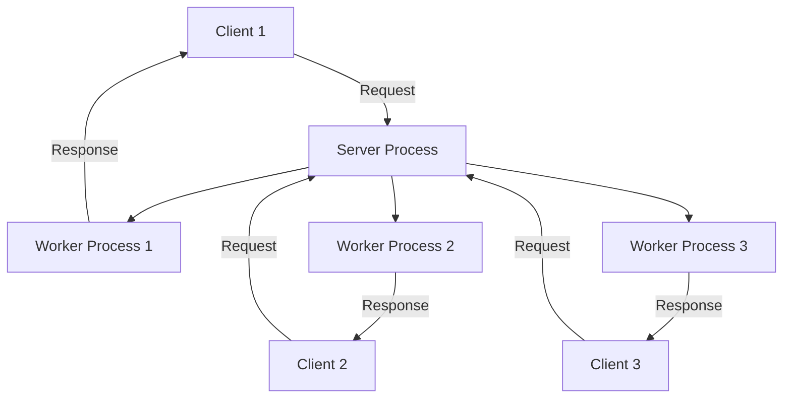

### 4. Multi Process Multi Thread
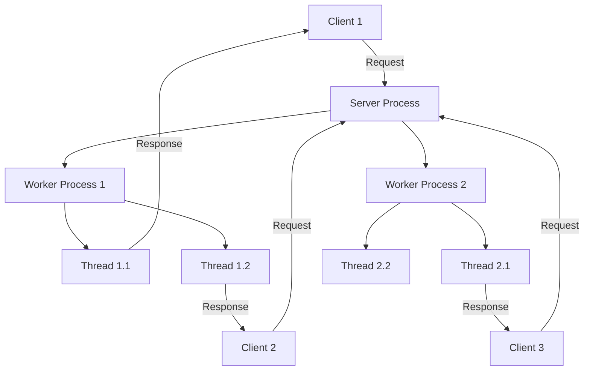

## Scalability Patterns and Real-World Examples

### 1. Load Balancing Strategies

#### Round Robin DNS
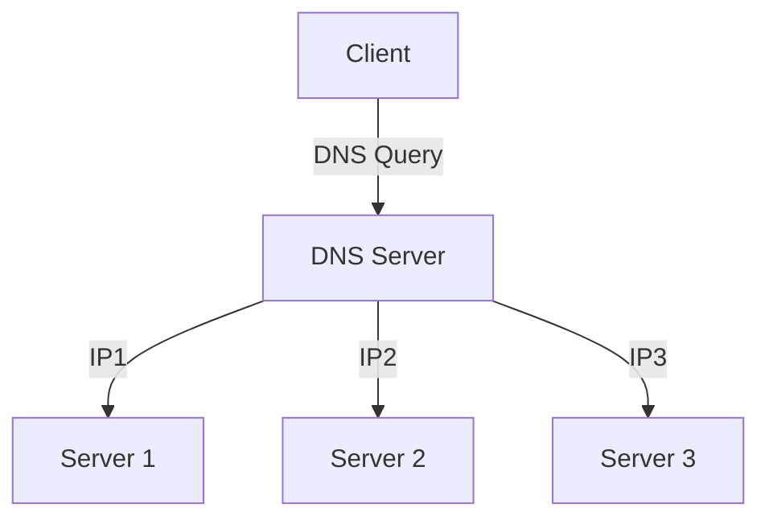

**Example:** Cloudflare's DNS load balancing

#### Application Load Balancer
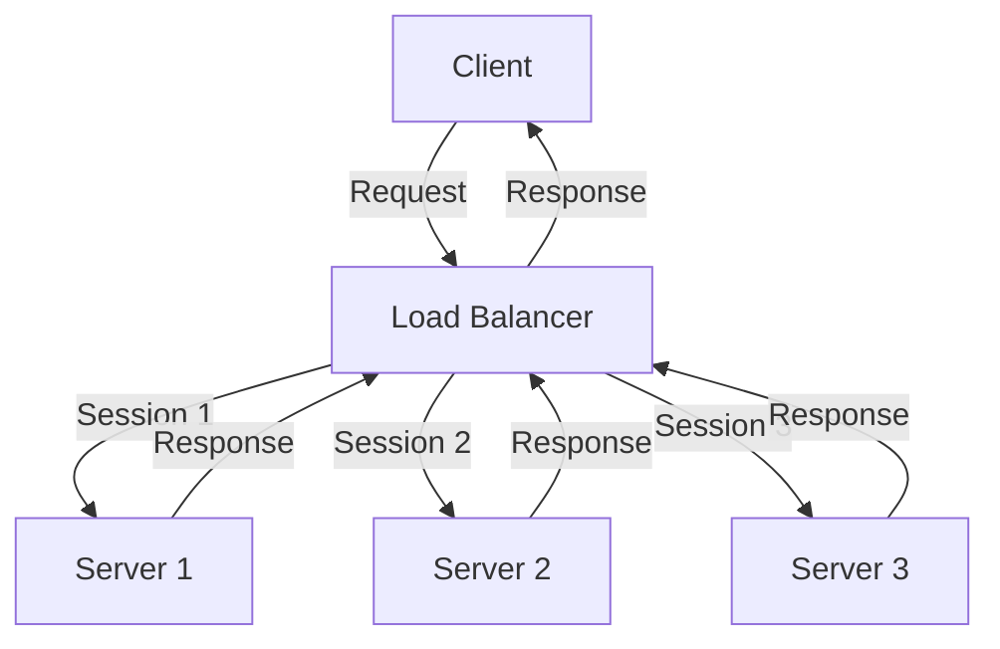

**Example:** AWS ALB, Nginx Plus

### 2. Database Scaling Patterns

#### Read/Write Splitting
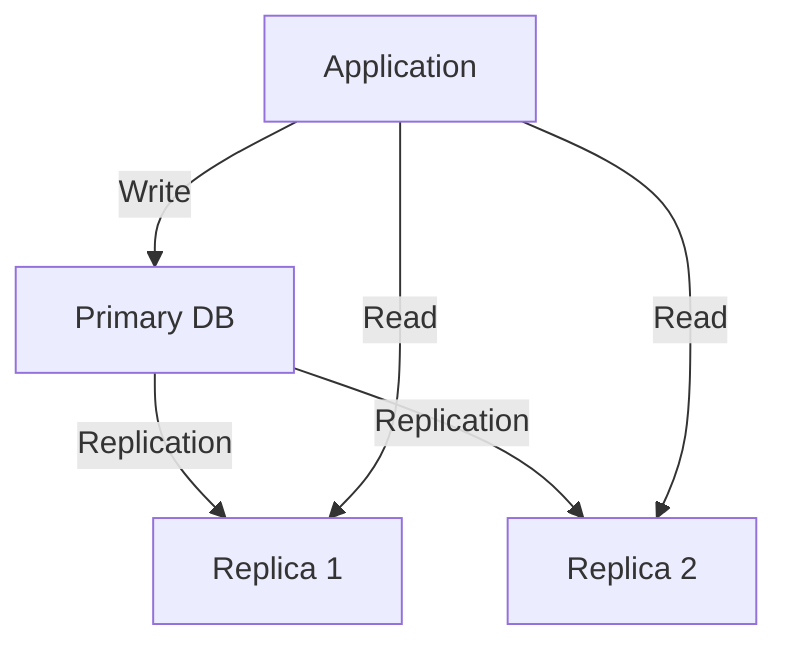

**Example:** MySQL Replication, PostgreSQL Streaming Replication

#### Sharding
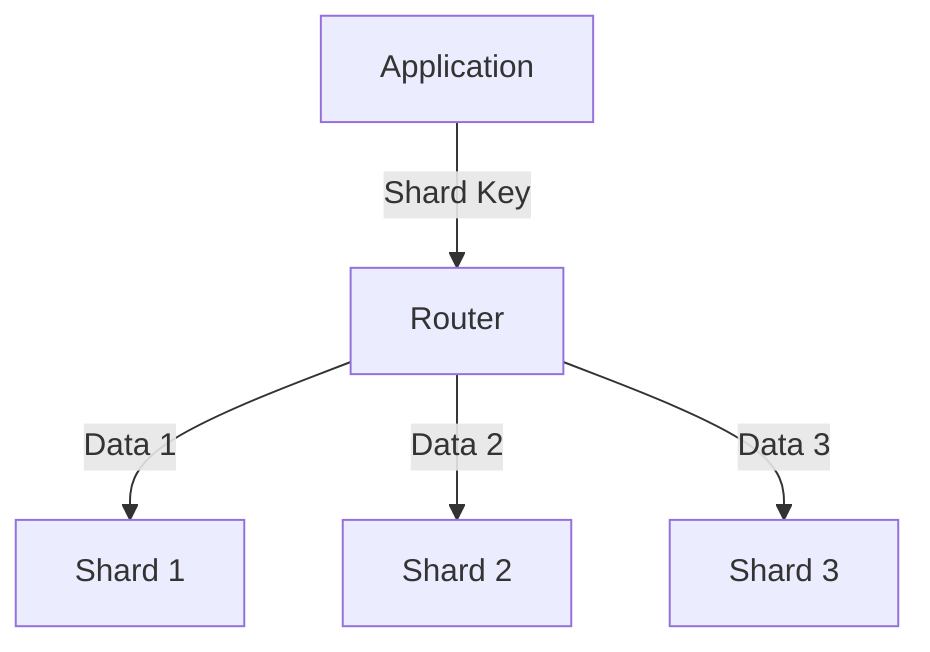

**Example:** MongoDB Sharding, Vitess

### 3. Caching Strategies

#### Distributed Cache
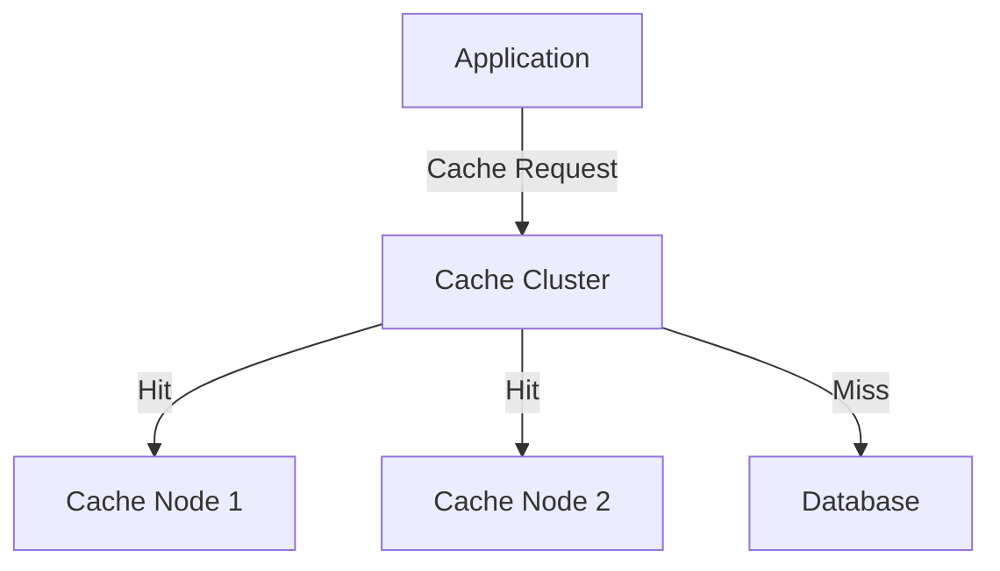

**Example:** Redis Cluster, Memcached

#### CDN Architecture
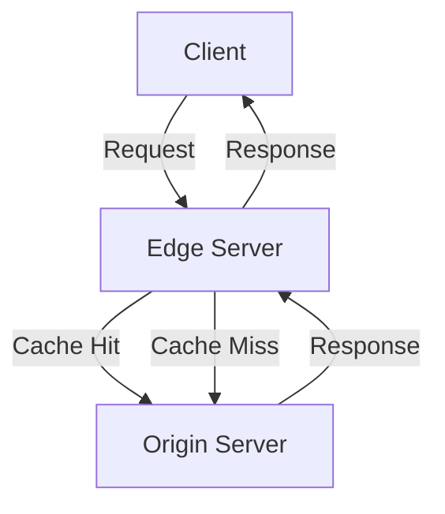

**Example:** Cloudflare, Akamai

### 4. Message Queue Patterns

#### Pub/Sub Architecture
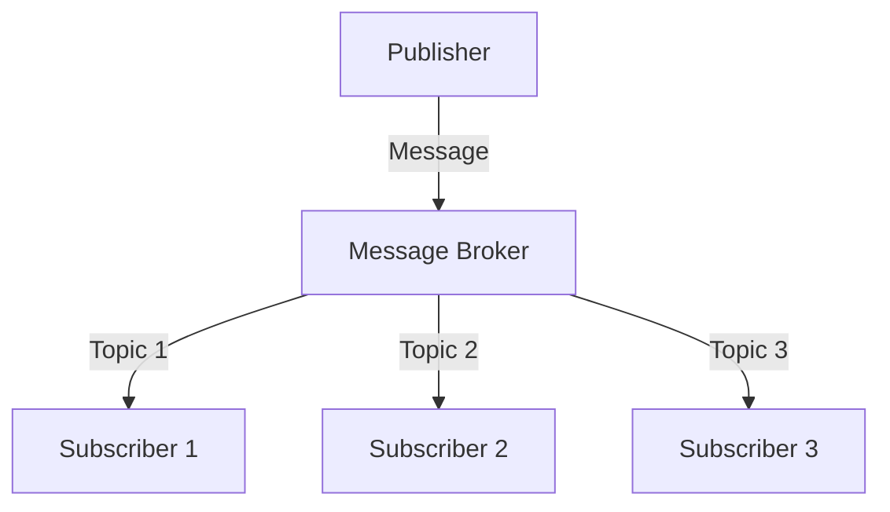

**Example:** Apache Kafka, RabbitMQ

#### Worker Queue
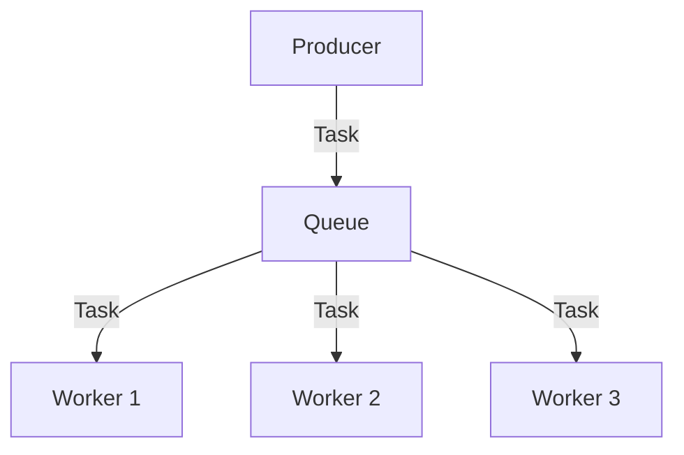

**Example:** Celery, Sidekiq

### 5. Microservices Architecture

#### Service Mesh
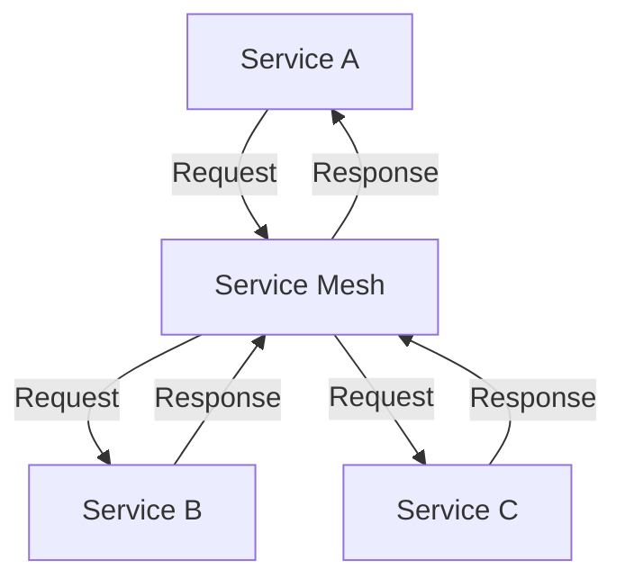

**Example:** Istio, Linkerd

#### API Gateway
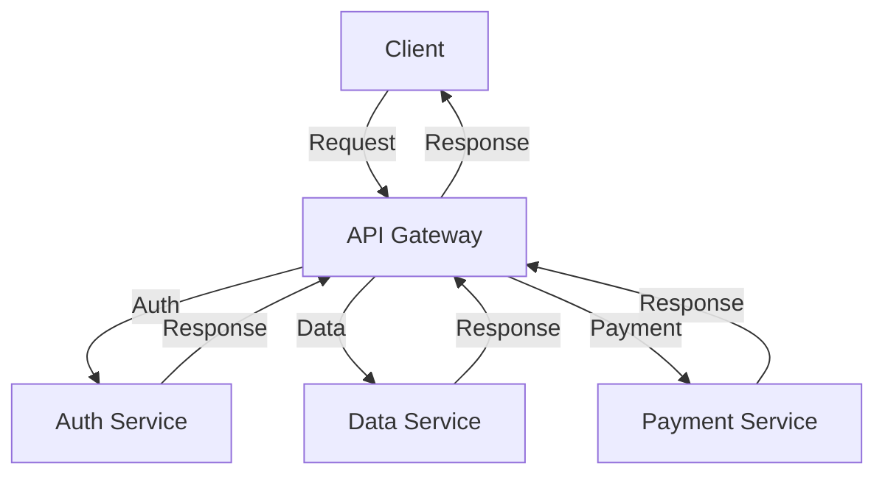

**Example:** Kong, AWS API Gateway

## Implementation Guidelines

### 1. Choosing the Right Pattern

1. **I/O-Bound Workloads**
   - Use event-driven architecture
   - Implement connection pooling
   - Consider non-blocking I/O

2. **CPU-Bound Workloads**
   - Use process-based parallelism
   - Implement work stealing
   - Consider thread pools

3. **Mixed Workloads**
   - Combine multiple patterns
   - Use hybrid approaches
   - Implement proper isolation

### 2. Monitoring and Scaling

1. **Metrics to Monitor**
   - Request latency
   - Error rates
   - Resource utilization
   - Queue lengths

2. **Scaling Triggers**
   - CPU utilization
   - Memory pressure
   - Request queue length
   - Error rates

3. **Scaling Strategies**
   - Horizontal scaling
   - Vertical scaling
   - Auto-scaling
   - Predictive scaling
